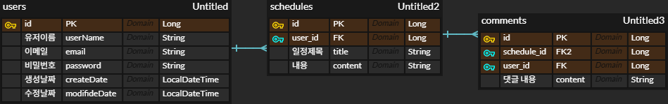

# Schedule Upgrade Project

## ERD


> 🔹 User 1:N Schedule  
> 🔹 Schedule 1:N Comment  
> 🔹 User 1:N Comment

---

## Postman API 예시

## **User API**

### 회원가입
```json
POST /users/signup
```
Request

```json
{
  "userName": "test",
  "email": "test@test.com",
  "password": "1234"
}
```
Response

```json
{
  "id": 1,
  "userName": "test",
  "email": "test@test.com",
  "createdDate": "2025-11-20T11:00:00",
  "modifiedDate": "2025-11-20T11:00:00"
}
```
---

### 로그인
```json

POST /users/login
```
Request
```json
{
  "email": "test@test.com",
  "password": "1234"
}
```
Response

```json
{
  "id": 1,
  "userName": "test",
  "email": "test@test.com",
  "message": "test님 로그인에 완료되었습니다."
}
```
---

### 유저 조회
```json
GET /users/{userId}
```
Response
```

```json
{
  "id": 1,
  "userName": "test",
  "email": "test@test.com",
  "createdDate": "2025-11-20T11:00:00",
  "modifiedDate": "2025-11-20T11:10:00"
}
```
## Schedule API
### 일정 생성
```json
POST /schedules
```
Request

```json
{
  "title": "회의",
  "content": "프로젝트 회의"
}
```
Response

```json
{
  "id": 1,
  "userName": "test",
  "title": "회의",
  "content": "프로젝트 회의",
  "createdDate": "2025-11-20T11:30:00",
  "modifiedDate": "2025-11-20T11:30:00"
}
```

---

### 전체 일정 조회
```json
GET /schedules/all
```
Response
```json
[
  {
    "userName": "test",
    "title": "회의",
    "createdDate": "2025-11-20T11:30:00",
    "modifiedDate": "2025-11-20T11:30:00"
  }
]
```
---

### 특정 일정 조회
```json
GET /schedules/{scheduleId}
```
Response

```json
{
  "id": 1,
  "userName": "test",
  "title": "회의",
  "content": "프로젝트 회의",
  "createdTime": "2025-11-20T11:30:00",
  "modifiedTime": "2025-11-20T11:30:00"
}
```
---

### 일정 수정
```json

PUT /schedules/{scheduleId}
```
Request

```json
{
  "title": "회의 수정",
  "content": "회의 내용 업데이트",
  "password": "1234"
}
```
Response

```json
{
  "id": 1,
  "title": "회의 수정",
  "content": "회의 내용 업데이트"
}
```
---

## Comment API
### 댓글 생성
```json
POST /schedules/{scheduleId}/comments
```
Request

```json
{
  "content": "회의 시작 전 확인할 것"
}
```
Response

```json
{
  "id": 1,
  "userName": "test",
  "content": "회의 시작 전 확인할 것",
  "createdDate": "2025-11-20T11:45:00",
  "modifiedDate": "2025-11-20T11:45:00"
}
```
---

### 댓글 조회
```json
GET /schedules/{scheduleId}/comments
```
Response

```json
[
  {
    "id": 1,
    "userName": "test",
    "content": "회의 시작 전 확인할 것",
    "createdDate": "2025-11-20T11:45:00",
    "modifiedDate": "2025-11-20T11:45:00"
  }
]
```
---

### 댓글 수정
```json
PUT /comments/{commentId}
```
Request
```json
{
  "content": "회의 시작 전 확인 완료",
  "password": "1234"
}
```
Response

```json
{
  "id": 1,
  "content": "회의 시작 전 확인 완료"
}
```
---

### 댓글 삭제
```json
DELETE /comments/{commentId}
```
Request

```json
{
  "password": "1234"
}
```
Response
```json
상태 코드 204 No Content
```

---

## 프로젝트 개요

기술 스택: Spring Boot, JPA, MySQL/H2, Lombok, Jakarta Validation

주요 기능:

유저 관리: 회원가입, 로그인/로그아웃, 조회, 수정, 삭제

일정 관리: 생성, 조회, 페이징, 수정, 삭제

댓글 관리: 생성, 조회, 수정, 삭제

보안: 세션 기반 인증, BCrypt 비밀번호 검증

예외 처리: GlobalExceptionHandler로 CustomException, Validation, 서버 예외 통합 처리

---

##  엔티티 구조
엔티티	주요 필드	관계
User	id, userName, email, password	1:N Schedule, 1:N Comment
Schedule	id, title, content, user	1:N Comment
Comment	id, content, user, schedule	-
BaseEntity	createdDate, modifiedDate	공통 상속

---

##  공통 기능
PasswordEncoder: BCrypt 해싱 및 검증

SessionFilter: 세션 기반 로그인 체크

GlobalExceptionHandler: CustomException, ValidationException, 서버 예외 처리
